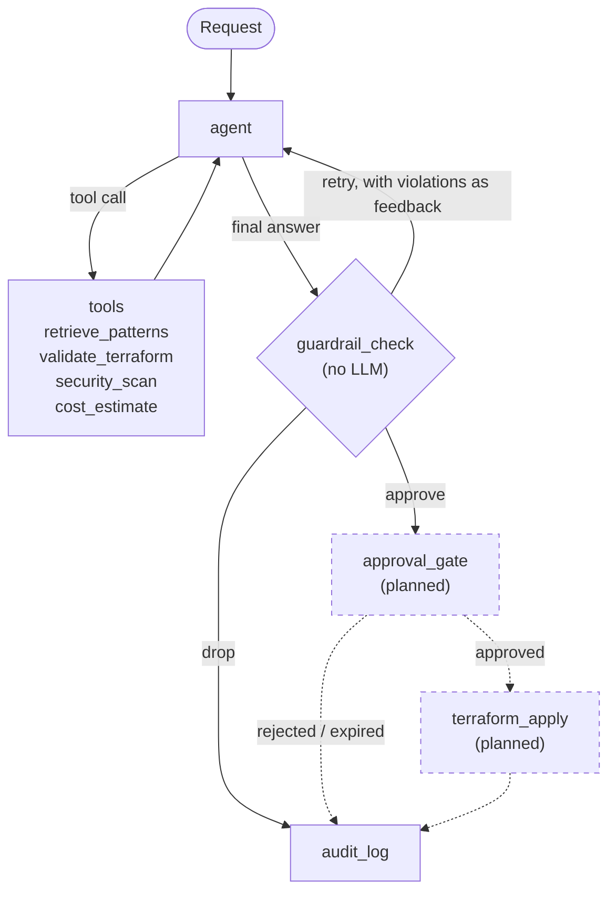

# cloud-infra-agent

A ReAct-based [LangGraph](https://langchain-ai.github.io/langgraph/) agent that turns plain-language infrastructure requests into vetted, retrieval-grounded Terraform for AWS. Generated code is validated, security-scanned and cost-estimated, then passed through a deterministic guardrail that enforces organisational policy before anything is offered for human approval.

> **Status: work in progress.** The generation, verification and guardrail pipeline works end to end. The human approval gate, durable audit log and the apply step are not built yet, so **nothing in this repository can create, change or delete an AWS resource today.** See [Status](#status) and [Roadmap](#roadmap).

## Why this exists

An LLM asked for Terraform will write something plausible, but it does not know your regions, tagging rules or cost limits, and it will occasionally state a policy fact with confidence and be wrong. This project treats the model as an untrusted proposer:

- **Retrieval** steers it toward approved patterns and standards, so compliant output is likely.
- **Deterministic checks** decide what is acceptable, so non-compliant output cannot pass. The guardrail never asks the model whether the code is fine.

## Architecture



- **Agent node.** A single LLM (`gpt-4o` via `langchain-openai`) bound to four tools, looping until it answers without requesting a tool. It decides the order of actions itself: there is no fixed pipeline.
- **Tools.** Retrieve approved templates and standards; run `terraform validate`; run Checkov and Trivy; estimate monthly cost with Infracost.
- **Guardrail.** Takes only the generated HCL and re-derives every fact itself. It does not trust the agent's account of what its tools reported. It makes one decision, and a conditional edge routes on it: **approve**, **retry** (violations are sent back to the agent as feedback, capped at 3 attempts) or **drop**.
- **State.** A typed `StateGraph` state. Reducers append to the conversation history and the audit trail instead of overwriting them.

## Design decisions

| Decision | Reason |
|---|---|
| **Guidance and enforcement are separate.** `standards.md` is retrieved by the agent; `policies.yaml` is read directly by the guardrail. | A model can forget or misread a rule. Plain code cannot. |
| **One source of truth for values.** The loader injects values from `policies.yaml` into the retrieved standards at index time. | Rules must reach the model as concrete values, not a pointer to a file. A rule that only said "see policies.yaml" led the model to guess. |
| **Always-applicable rules are pinned, not searched.** Tagging, region and security standards are fetched by id on every retrieval. | Similarity search suits content that varies by request. "Create a bucket" looks nothing like "allowed regions", so that rule ranked last. |
| **Retrieval has a relevance cutoff.** Hits above a distance threshold are dropped. | Nearest-neighbour search always returns something, however irrelevant. |
| **Retrieval key and payload are separate.** A short description is embedded; the full template is returned. | Embedding models read only a few hundred tokens, so embedding a long template blurs what it is for. |
| **Fail closed.** A scanner that crashes, a missing estimate or an unexpected HCL shape is a recorded failure, never a pass. | In a control, a silent failure looks identical to a clean result. |
| **Risk acceptance is recorded.** Accepted scanner findings live in `policies.yaml` with a reason, are hidden from the agent, and are counted in every result. | Stops the agent adding unrequested resources to satisfy generic findings, without hiding anything silently. |
| **Generated code is untrusted input.** `terraform validate` executes provider binaries, so providers are allow-listed and modules are refused before it runs. | The HCL is produced by a model that reads user requests. |

## What the guardrail checks

- `terraform validate` passes
- Region is in the allow-list, and resolves to a value
- Mandatory tags are present; `Environment` is one of `dev`, `staging`, `prod`; `ManagedBy` is `terraform`
- Storage encryption is explicit (S3, RDS, EBS), S3 public access is fully blocked, no public ACLs
- No ingress from `0.0.0.0/0` except on ports 80 and 443
- No IAM policy granting `Action: *` on `Resource: *`
- Every variable has a default, because apply cannot prompt for values
- Checkov and Trivy report no unresolved findings
- Estimated monthly cost is under the ceiling (converted to INR)
- Free-tier deviations are reported (advisory by default, configurable to blocking)

## Status

| Component | State |
|---|---|
| Knowledge base: standards, policies, defaults, S3 module template | Working |
| Retrieval: chunking, local embeddings, Chroma, `retrieve_patterns` | Working |
| `validate_terraform`, `security_scan`, `cost_estimate` tools | Working |
| Agent node and ReAct loop | Working |
| `guardrail_check` and three-way routing | Working |
| `approval_gate` | Stub |
| `audit_log` | Stub |
| `terraform_apply` | Not started |
| Module templates: EC2, IAM role, RDS, VPC | Not started |
| Automated test suite | Not started |

## Repository layout

```
kb/
  standards.md            prose standards, retrieved by the agent
  policies.yaml           hard rules, read by the guardrail
  defaults.yaml           organisation defaults (placeholders)
  modules/                vetted Terraform templates, one file per pattern
src/cloud_infra_agent/
  loader.py               chunks the knowledge base
  store.py                embeddings and the Chroma index
  tools.py                retrieve_patterns
  terraform_tools.py      validate_terraform
  scan_tools.py           security_scan (Checkov + Trivy)
  cost_tools.py           cost_estimate (Infracost)
  agent.py                agent node, system prompt, router
  guardrail.py            guardrail node and policy checks
  state.py                typed graph state
  graph.py                graph wiring and CLI entry point
```

## Getting started

**Prerequisites:** [uv](https://docs.astral.sh/uv/), the [Terraform](https://developer.hashicorp.com/terraform), [Checkov](https://www.checkov.io/), [Trivy](https://trivy.dev/) and [Infracost](https://www.infracost.io/) CLIs on your `PATH`, an OpenAI API key and an Infracost API key.

```bash
uv sync
```

Provide `OPENAI_API_KEY` and `INFRACOST_API_KEY` through a local `.env` file. It is git-ignored; never commit it.

Set your own organisation defaults by copying the values in `kb/defaults.yaml` into a `kb/defaults.local.yaml` (also git-ignored) and editing them.

Build the retrieval index, then run a request:

```bash
uv run python -m cloud_infra_agent.store
uv run python -m cloud_infra_agent.graph "Create a private S3 bucket for audit logs in the dev environment, in eu-west-1."
```

The run prints the audit trail, the guardrail verdict (with any violations and warnings) and the estimated cost. Re-run the `store` command whenever files in `kb/` change.

Each component can be exercised on its own:

```bash
uv run python -m cloud_infra_agent.loader
uv run python -m cloud_infra_agent.tools
uv run python -m cloud_infra_agent.terraform_tools
uv run python -m cloud_infra_agent.scan_tools
uv run python -m cloud_infra_agent.cost_tools
uv run python -m cloud_infra_agent.guardrail
```

### Adding a module template

1. Add `kb/modules/<name>.md` with front matter (`resource`, `module`, `tags_covered`), a "Use for" and "When to pick this pattern" section with keywords, and the Terraform under a `## Terraform` heading.
2. Run the template through `terraform_tools` and `scan_tools`, and record any deliberately accepted findings in `policies.yaml`.
3. Rebuild the index.

## Safety

- Nothing runs `terraform plan` or `apply`. Terraform is only ever run as `init -backend=false` and `validate`, which need no AWS credentials.
- Infracost receives resource types and attributes to look up prices, not the code or any credentials.
- The planned apply step will assume a narrowly scoped role just in time, so the agent process itself never holds write permissions.

## Known limitations

- Static policy checks read the HCL text. A value coming from a variable with no default cannot be resolved, which is why every variable must have a default.
- The IAM wildcard check is a coarse text match on the policy document.
- Ports 80 and 443 are allowed from the internet on any security group, because the code does not show which ones front a load balancer.
- Usage-based costs (for example S3 storage and requests) are not priced without usage data. They are reported as such rather than shown as free.
- Cost is estimated at list price with no free-tier credit applied.
- Only one module template exists so far.

## Roadmap

- Templates for EC2, IAM role, RDS and VPC
- `approval_gate` using `interrupt()` and a Postgres checkpointer, so a paused run survives restarts
- `audit_log` writing every outcome (executed, dropped, rejected, expired, refused) to DynamoDB and S3, including the reason
- `terraform_apply` behind the gate, with a just-in-time write role
- Automated tests (pytest, with `moto` for AWS)

## Tech stack

Python, LangGraph, LangChain, OpenAI, Chroma, sentence-transformers, python-hcl2, Terraform, Checkov, Trivy, Infracost, PostgreSQL (planned checkpointer), DynamoDB and S3 (planned audit store).